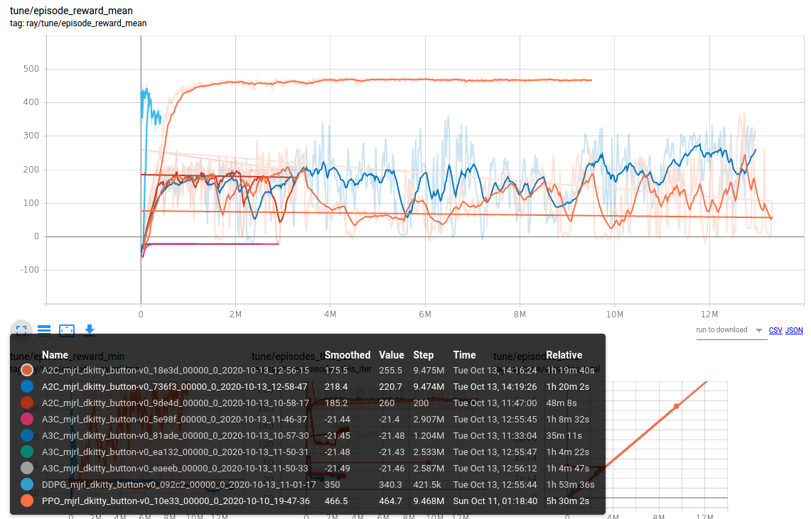

# dkitty button env

## Installation

```
git clone https://github.com/wangcongrobot/gym_button.git
cd gym_button
pip install -e .
python gym/envs/mjrl/test_env.py

pip install ray[rllib]
```

## Training
Use RLlib to train with different algos
```
rllib train --run PPO --env mjrl_dkitty_button-v0 --checkpoint-freq 10 --config '{"num_workers": 25, "ignore_worker_failures": true}'

rllib train --run A2C --env mjrl_dkitty_button-v0 --checkpoint-freq 10 --config '{"num_workers": 25, "ignore_worker_failures": true}'

rllib train --run A3C --env mjrl_dkitty_button-v0 --checkpoint-freq 10 --config '{"num_workers": 25, "ignore_worker_failures": true}'

rllib train --run DDPG --env mjrl_dkitty_button-v0 --checkpoint-freq 10 --config '{"num_workers": 25, "ignore_worker_failures": true}'

rllib train --run TD3 --env mjrl_dkitty_button-v0 --checkpoint-freq 10 --config '{"num_workers": 25, "ignore_worker_failures": true}'
```

## Results


